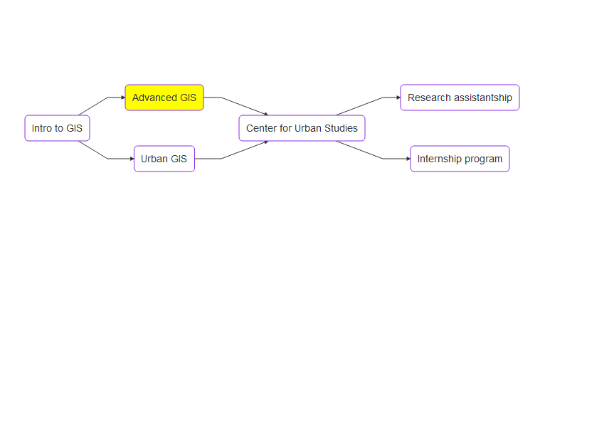

# Introduction and GIS review

---

## Syllabus

* Available on Learning Studio, let's take a look...

---

## Our GIS program

* Companion course: Data Analysis & Visualization (every Fall)

---

## Semester project

* Your chance to show the world what you can do with GIS!
* You will use GIS to independently address a research topic of your choice (in consultation with me)
* This is a __semester__ project, not a __final project__ - meaning you can't put it off until the last minute!

---

## Semester project: key dates

* January 23 (next week!): A one-paragraph description of your proposed project
* Mid-March: Submission deadline for AddRan Festival of Undergraduate Research
* Mid-April: AddRan Festival of Undergraduate Research
* April 24: Posters due
* April 27, 29: Poster presentations
* May 4: Final report due

---

## Project proposal

* Short (~250 words) description of your proposed research project
* Should be on a topic of keen interest to you, or relevant to something you'd like to pursue after graduation
* Short meetings with me the week of January 26
* Tutorial points for Week 2

---

## Poster presentation

* We'll be holding two poster "sessions" during class time on April 27 and 29
* Examples: [Stephen Lopez](http://stephenmaps.weebly.com/graphic-design.html) and [Morgan Klaas](http://morganklaasmapping.weebly.com/food-deserts.html)

---

## Final report

* ~8 page report that presents the results of your research project
* Should include an introduction, literature review, methodology section, results section, and conclusion, as well as maps!

---

## AddRan Festival 

* Submission deadline March 19; festival to take place April 15

---

## GIS review

* Let's see what you remember!  Complete the review quiz on Learning Studio for this week's tutorial points.  

